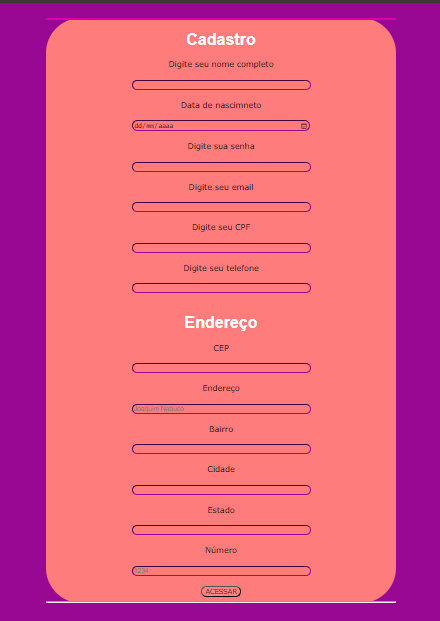

# Formulario de Cadastro de Endereço
Projeto criado em sala de aula com ajuda do Professor Leonardo Santiago Sidon da Rocha.

* [Projeto](#Formulario-de-Cadastro-de-Endereco)
* [Capa-do-Projeto](#capa-do-projeto) 
* [Descrição](#descrição)   
* [Funcionalidades](#funcionalidades)  
* [Tecologias utilizadas](#tecologias-utilizadas)  
* [Fontes consultadas](#fontes-consultadas)  
* [Autores](#autores)
## 🖼️Capa do Projeto

## 📄Descrição

Este projeto tem a função de fazer um cintqto completo
## 👾Funcionalidades

Possui uma Função que se você digitar seu cep o programa completará o endereço, bairro, Cidade, numero e o Estado

### 🎨Tabela de cores

* 🖤PRETO 
* 💜ROXO
* 💗ROSA

### 🤖Tecologias utilizadas
* HTML 5
* CSS 3
* JavaScript
## 🔧Ferramentas utilizadas
* Chat gpt
* GitHub
* VScode
## 🔗Fontes consultadas
* Google
* https://www.alura.com.br/
## 🤜🤛Colaboradores
* Leonardo Santiago Sidon da Rocha
* Witória Beatriz
* Jasminy Matias

## ✒️Autores
Juan Fernandes Goes de Souza
